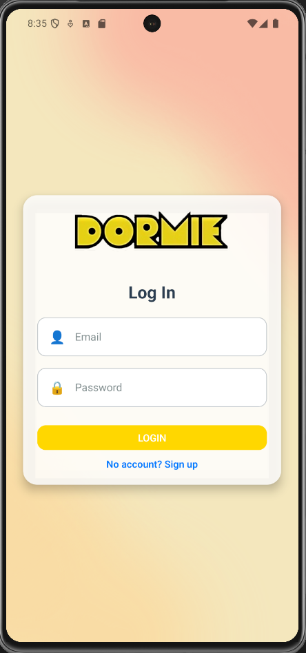
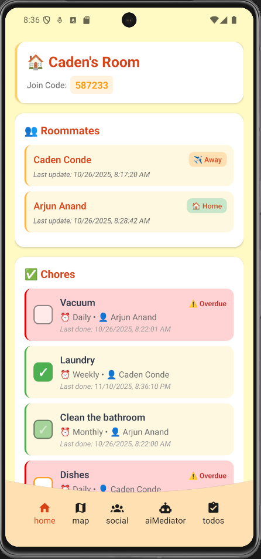
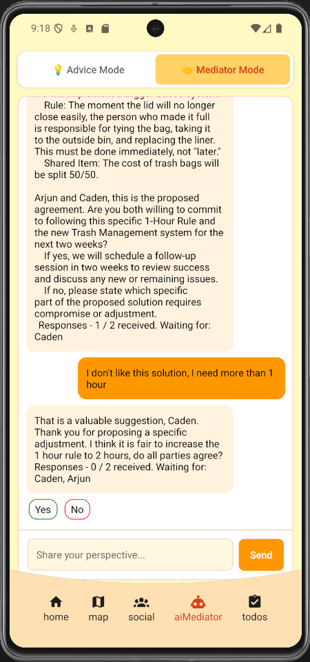

  

# Dormie
**AI-Powered Roommate Solutions**

Dormie helps students manage all aspects of shared living with ease. From chore distribution to conflict resolution, Dormie uses AI to make dorm life smoother, smarter, and more connected.

## 🚀 Inspiration
Living with roommates can be both rewarding and stressful. We wanted to build a tool that supports collaboration, communication, and fairness in shared spaces.

## 💡 Features
- **Chore Management** – Automatically assigns and tracks shared responsibilities.  
- **Location Sharing** – See who’s home or away to plan better.  
- **AI Conflict Mediation** – Uses natural language understanding to suggest fair and empathetic solutions.
- **Secure Account Management** - Firebase Authentication to create and manage user accounts.

## 🖼️ Screenshots
Add images here to showcase your app’s design and features:  

  
  
  

## 🧠 How It Works
Dormie brings together several modern technologies:

| Component | Technology |
|------------|-------------|
| Frontend | React Native (TypeScript) |
| Backend API | Python with FastAPI |
| Database & Auth | Firebase |
| AI Processing | LLM Integration via FastAPI endpoint |

## 🏆 Recognition
**Most Social Impact Superlative – HackOHI/O 13 (2025)**  
Awarded to the project that best addresses a real-world problem and has the greatest potential to make a positive difference in a community.

## 👥 Team
- [Caden Conde](https://github.com/CadenConde)  
- [Arjun Anand](https://github.com/creemy0cheesekake)  
- [Ryan Lee](https://github.com/ryjl33)  
- Dominic Allie
